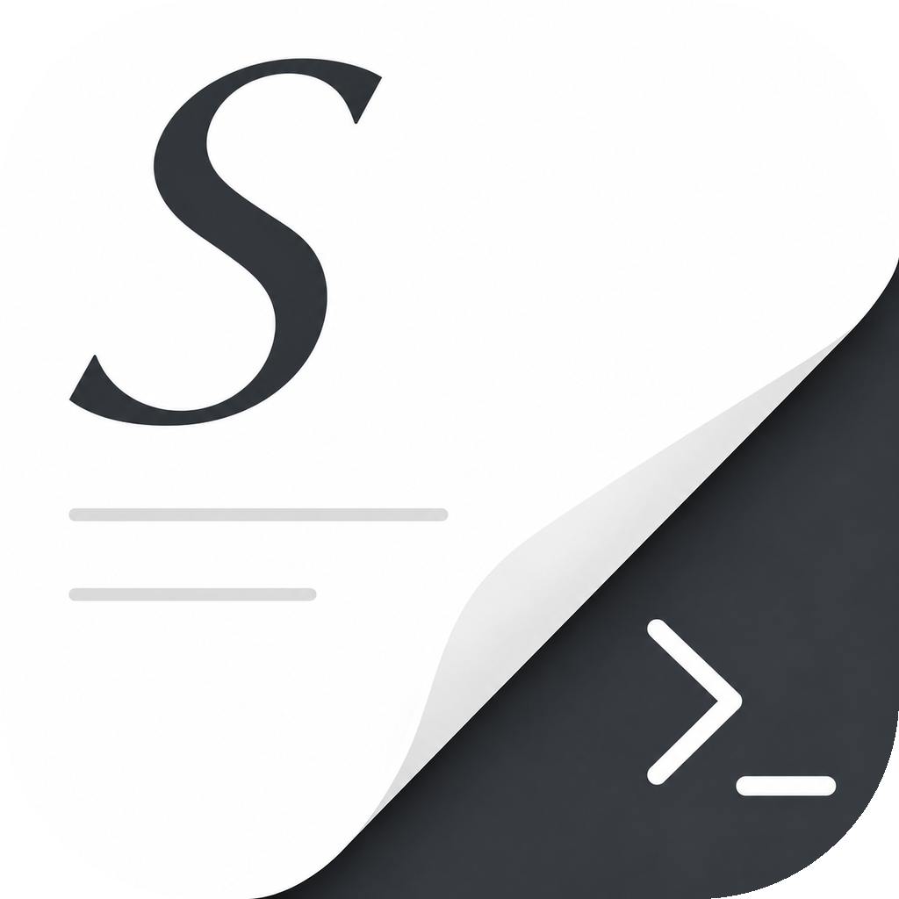
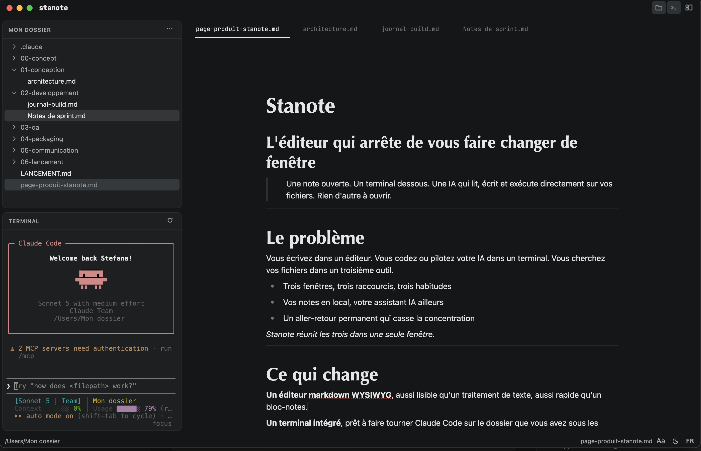
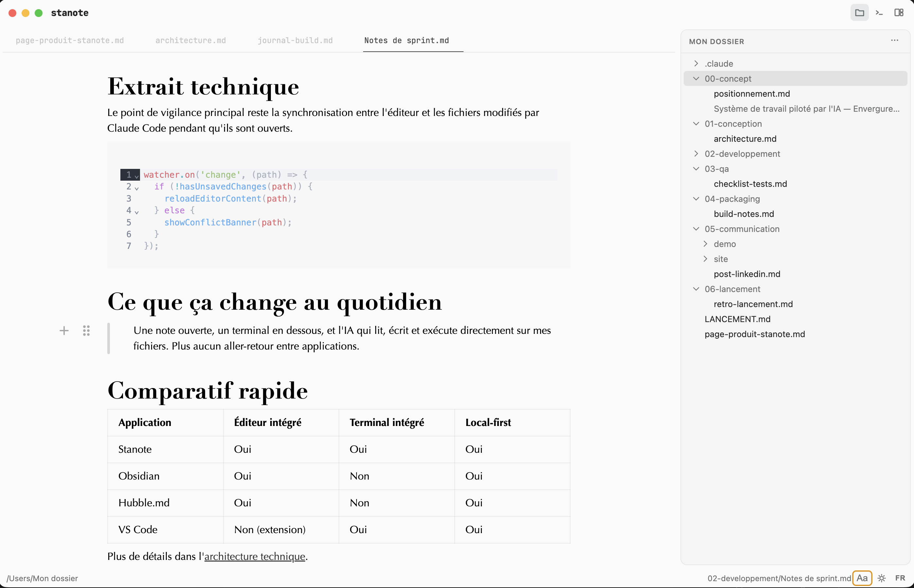

<div align="center">
  
  <h1>Stanote</h1>
  <p><strong>Vos notes markdown, un terminal et vos fichiers — dans une seule fenêtre.</strong></p>
  <p>Un éditeur de notes local pour macOS, pensé pour celles et ceux qui écrivent <em>et</em> codent.</p>
</div>

---

Stanote réunit trois outils que vous jonglez toute la journée : un éditeur markdown WYSIWYG, un vrai terminal et un navigateur de fichiers. Ouvrez un dossier de projet, rédigez vos notes en mise en forme directe, et lancez vos commandes juste à côté — sans quitter l'application. Quand un outil en ligne de commande modifie un fichier ouvert, l'éditeur se met à jour tout seul. Vos notes restent de simples fichiers `.md` sur votre disque : rien n'est enfermé.

## Aperçu

<div align="center">
  
  
</div>

## Fonctionnalités

- **Éditeur markdown WYSIWYG** — mise en forme directe (titres, gras, listes, tâches, tableaux, code, citations), menu de commandes « / », onglets multiples et sauvegarde automatique. Interface entièrement bilingue (français / anglais).
- **Terminal intégré** — un vrai shell (zsh) ouvert dans le dossier de votre projet. Idéal pour lancer vos scripts ou vos assistants en ligne de commande sans changer de fenêtre.
- **Synchronisation disque** — un fichier ouvert modifié à l'extérieur se recharge silencieusement ; en cas de modifications non enregistrées, un bandeau vous laisse choisir. Pensé pour cohabiter avec les outils qui écrivent dans vos fichiers.
- **Navigateur de fichiers** — arbre du dossier, créer / renommer / supprimer, « Révéler dans le Finder », fichier actif surligné, rafraîchissement automatique.
- **Recherche instantanée** — recherche plein texte dans tout le dossier (ripgrep) et ouverture rapide d'un fichier par son nom (`⌘P`).
- **Trois dispositions & multi-fenêtres** — éditeur à gauche, à droite, ou en barre latérale — au choix, d'un clic. Ouvrez autant de projets que nécessaire dans des fenêtres indépendantes.
- **Visionneuse intégrée** — aperçu des PDF, images et fichiers HTML sans quitter votre espace de travail.
- **Export PDF** — exportez n'importe quelle note en PDF mis en forme.
- **Sur mesure** — thème clair (blanc tiède) ou sombre, et un choix de couples de polices (SF Pro, Didot, Futura, Optima).
- **Local d'abord** — vos notes sont de simples fichiers markdown sur votre machine. Aucun cloud, aucun format propriétaire.

## Installation

Stanote est une application de bureau. Téléchargez la dernière version depuis la [page des releases](https://github.com/stefanands/stanote/releases) (macOS, puce Apple).

> L'application n'est pas signée (distribution personnelle). Au premier lancement, macOS peut la bloquer — clic droit sur l'app → **Ouvrir**, puis confirmez. (Les builds signés/notarisés sont pris en charge en CI ; voir plus bas.)

## Compiler depuis les sources

Prérequis : **Node.js 20+**, **npm**, et les **outils en ligne de commande Xcode** (pour le module natif `node-pty`).

```bash
git clone https://github.com/stefanands/stanote.git
cd stanote
npm install          # recompile aussi node-pty pour Electron (postinstall)
npm run dev          # lancer en développement
npm run dist:mac     # produire un .dmg dans release/
```

## Stack technique

Electron · electron-vite · React · TypeScript · [Milkdown](https://milkdown.dev) (éditeur) · [xterm.js](https://xtermjs.org) + node-pty (terminal) · [@vscode/ripgrep](https://github.com/microsoft/vscode-ripgrep) (recherche) · react-resizable-panels · zustand.

## Contribuer

Les contributions sont les bienvenues — voir [CONTRIBUTING.md](CONTRIBUTING.md) et le [Code de conduite](CODE_OF_CONDUCT.md). Pour les problèmes de sécurité : voir [SECURITY.md](SECURITY.md).

## Licence

[MIT](LICENSE) © 2026 Stefana Andriason
