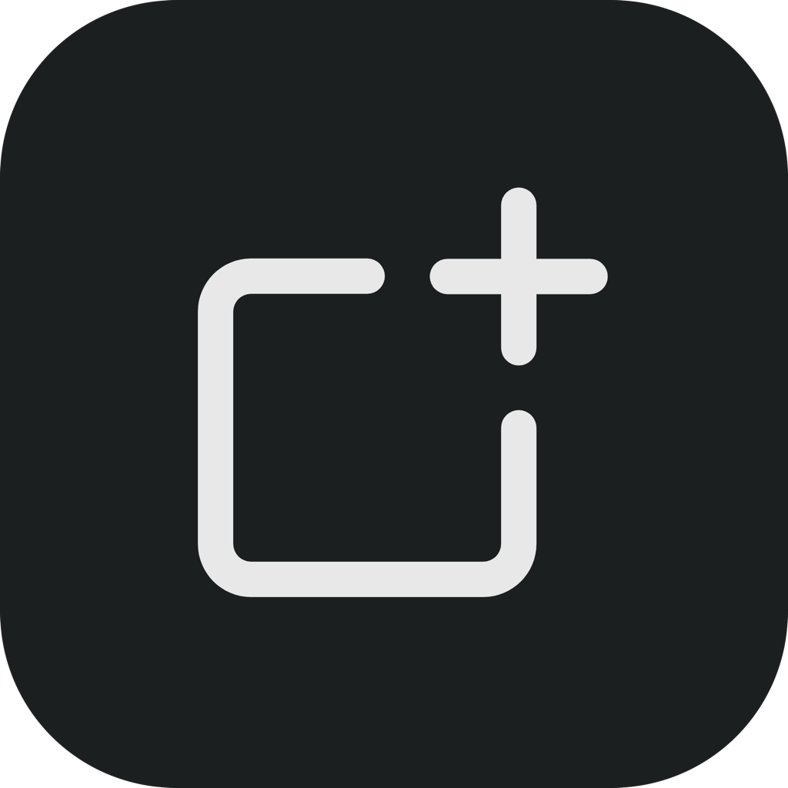
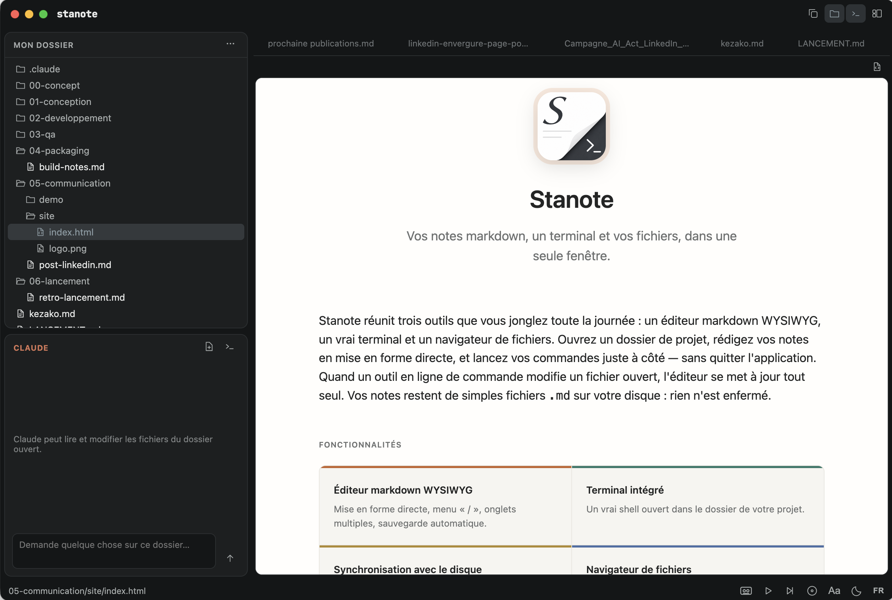
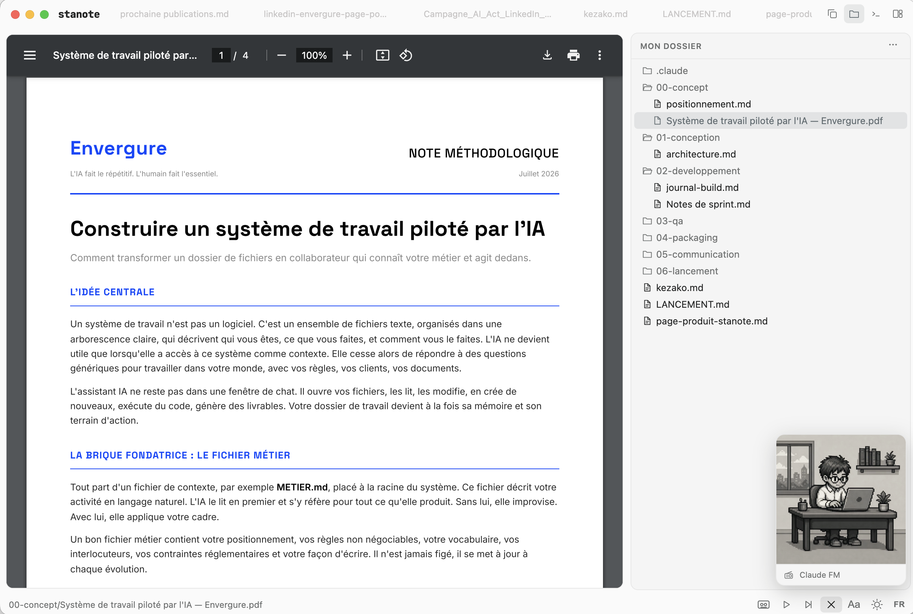

<div align="center">
  
  <h1>Stanote</h1>
  <p><strong>Un environnement de travail local pour écrire, structurer vos fichiers et utiliser l’IA dans le contexte de vos projets.</strong></p>
  <p>Notes, documents, terminal et assistant IA réunis autour d’un même dossier.</p>
</div>

---

Stanote est un éditeur de notes et de fichiers pour macOS. Il s’organise autour de votre dossier de travail : vous écrivez en Markdown, consultez vos documents, modifiez les fichiers utiles et utilisez votre assistant IA sans perdre le contexte du projet.

Les fichiers restent sur votre Mac, dans leurs formats habituels. Stanote n’impose ni cloud ni format propriétaire.

## Aperçu

<div align="center">
  
  
</div>

## Fonctionnalités

- **Éditeur Markdown** — mise en forme directe pour les notes, documents, listes, tableaux et extraits de code. Plusieurs fichiers peuvent rester ouverts, avec sauvegarde automatique.
- **Dossier de travail** — navigateur de fichiers, recherche plein texte, ouverture rapide, création, renommage et synchronisation avec les changements réalisés hors de l’application.
- **IA dans le contexte du projet** — le panneau Claude permet de travailler à partir du dossier ouvert : l’assistant peut lire, modifier et créer les fichiers nécessaires au projet.
- **Fichiers texte et pages web** — les formats usuels s’ouvrent dans un éditeur adapté. Les pages HTML peuvent être consultées sous forme de rendu interactif ou modifiées directement.
- **Terminal intégré** — exécutez vos commandes dans le dossier du projet, sans changer d’application.
- **Consultation de documents** — aperçu des PDF, images et pages web au sein de l’interface.
- **Interface configurable** — thèmes clair et sombre, choix de polices, dispositions de panneaux et fenêtres de projet indépendantes.
- **Radio intégrée** — un lecteur discret dans la barre de statut, partagé entre les fenêtres ouvertes.
- **Données locales** — vos notes restent des fichiers Markdown et vos documents ne quittent pas votre machine.

## Installation

**[Télécharger Stanote pour Mac](https://github.com/stefanands/stanote/releases/latest)** — compatible avec les Mac équipés d’une puce Apple (M1, M2, M3, M4…).

Ouvrez le fichier DMG, puis faites glisser Stanote dans le dossier **Applications**.

> L’application est signée et notarisée par Apple : elle s’ouvre normalement depuis macOS.

## Compiler depuis les sources

Prérequis : **Node.js 20+**, **npm**, et les outils en ligne de commande Xcode.

```bash
git clone https://github.com/stefanands/stanote.git
cd stanote
npm install
npm run dev
npm run dist:mac
```

## Technique

Stanote est construit avec Electron, React, TypeScript, Milkdown et xterm.js.

## Contribuer

Les contributions sont les bienvenues — voir [le guide de contribution](docs/CONTRIBUTING.md) et le [Code de conduite](docs/CODE_OF_CONDUCT.md). Pour les problèmes de sécurité : voir la [politique de sécurité](docs/SECURITY.md).

## Licence

[MIT](LICENSE) © 2026 Stefana Andriason
